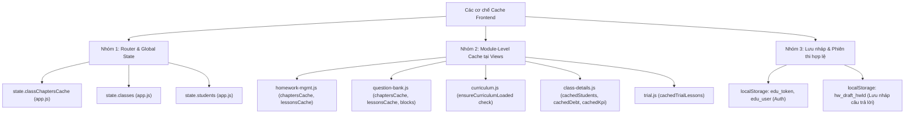
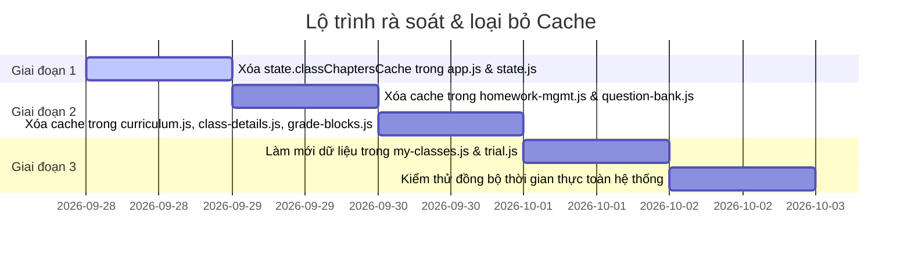

# 📋 KẾ HOẠCH RÀ SOÁT & LOẠI BỎ CACHE TRÊN FRONTEND

> **Mục tiêu**: Rà soát toàn bộ các vị trí đang lưu đệm dữ liệu (in-memory cache, module-level state, global cache) trên frontend, phân tích rủi ro/bất cập và thiết lập lộ trình loại bỏ để đảm bảo dữ liệu luôn đồng bộ thời gian thực theo đúng luồng API.

---

## I. TỔNG QUAN PHÂN LOẠI CƠ CHẾ CACHE TRÊN HỆ THỐNG

---

## II. CHI TIẾT TỪNG VỊ TRÍ SỬ DỤNG CACHE & ĐÁNH GIÁ RỦI RO

### 1. Nhóm Router & Global State (`app.js` & `state.js`)

| Tệp tin | Vị trí biến / Code | Cơ chế hoạt động hiện tại | Rủi ro & Bất cập | Đề xuất giải pháp |
| :--- | :--- | :--- | :--- | :--- |
| [`app.js`](file:///home/hocnguyen/Documents/Projects/exam/fe/src/js/app.js) / [`state.js`](file:///home/hocnguyen/Documents/Projects/exam/fe/src/js/state.js) | `state.classChaptersCache` (Dòng 172-251 `app.js`, dòng 12 `state.js`) | Lưu danh sách chương (`classChapters`) theo `classId`. Khi người dùng/học sinh quay lại lớp học, kiểm tra nếu đã có trong dictionary thì lấy ra dùng lại mà không gọi API. | **Lệch dữ liệu bài tập**: Khi giáo viên thêm bài tập/bài học mới vào lớp, học sinh chuyển qua lại giữa các lớp vẫn chỉ thấy danh sách cũ trong RAM cho đến khi F5 toàn trang. | **Xóa bỏ hoàn toàn** `state.classChaptersCache`. Khi truy cập lớp học, luôn gọi API `getChapters(classId, true)` mới nhất. |
| [`app.js`](file:///home/hocnguyen/Documents/Projects/exam/fe/src/js/app.js) | `const needClasses = (!state.classes \|\| state.classes.length === 0)` (Dòng 173 `app.js`) | Danh sách lớp chỉ được tải một lần duy nhất khi `state.classes` rỗng (áp dụng cho các trang: `students`, `curriculum`, `my-classes`, `class-details`, `student-details`, `question-bank`). | **Không cập nhật thông tin lớp**: Khi tạo lớp mới, đổi tên lớp, đổi học phí ở tab này, các trang khác vẫn giữ nguyên danh sách lớp cũ. | Cho phép tải tươi lại danh sách lớp (`api.getClasses()`) khi chuyển đến các trang quản trị chính. |
| [`app.js`](file:///home/hocnguyen/Documents/Projects/exam/fe/src/js/app.js) | `const needStudents = ...` (Dòng 175 `app.js`) | Danh sách học sinh toàn hệ thống chỉ tải khi `state.students` rỗng. | **Không cập nhật số dư / trạng thái**: Khi nạp tiền cho học sinh hoặc chuyển trạng thái tạm nghỉ, nếu điều hướng sang trang khác sẽ không thấy số dư mới ngay. | Luôn làm mới `state.students` khi truy cập trang Quản lý học sinh hoặc Chi tiết lớp học. |

---

### 2. Nhóm các trang Quản trị (Admin Views)

| Trang | Tệp tin | Vị trí Cache | Hiện trạng & Rủi ro | Giải pháp thực hiện |
| :--- | :--- | :--- | :--- | :--- |
| **Quản lý bài tập** | [`homework-mgmt.js`](file:///home/hocnguyen/Documents/Projects/exam/fe/src/js/views/homework-mgmt.js) | `chaptersCache = {}` `lessonsCache = {}` (Dòng 13, 14, 421, 455) | Bộ lọc Lớp -> Chương -> Bài học lưu danh sách vào biến module. Khi người dùng tạo chương mới hoặc đổi bài học ở trang khác, dropdown lọc không có dữ liệu mới. | Xóa 2 biến cache. Khi đổi chọn Lớp -> gọi trực tiếp `api.getChapters(classId)`. Khi đổi Chương -> gọi trực tiếp `api.getLessons(chapterId)`. |
| **Ngân hàng câu hỏi** | [`question-bank.js`](file:///home/hocnguyen/Documents/Projects/exam/fe/src/js/views/question-bank.js) | `chaptersCache = {}` `lessonsCache = {}` `cachedGradeBlocksList = []` (Dòng 14-16, 465, 498, 517) | Lưu đệm chương/bài học khi lọc câu hỏi và trong modal sinh đề ngẫu nhiên từ ma trận; lưu đệm khối lớp. | Xóa các biến cache này. Tải trực tiếp phân cấp Chương/Bài học từ API tương ứng khi người dùng tương tác chọn cấp độ. |
| **Khung chương trình** | [`curriculum.js`](file:///home/hocnguyen/Documents/Projects/exam/fe/src/js/views/curriculum.js) | `ensureCurriculumLoaded(classId)` (Dòng 32-35) | Hàm kiểm tra `if (state.curriculums.some(c => c.classId === classId)) return;`. Nếu đã xem lớp 1 lần thì lần sau bấm vào lớp đó sẽ không fetch lại từ server. | Bỏ câu lệnh kiểm tra tồn tại `some(...)`, luôn gọi API để nạp cấu trúc chương/bài học mới nhất của lớp được chọn. |
| **Chi tiết lớp học** | [`class-details.js`](file:///home/hocnguyen/Documents/Projects/exam/fe/src/js/views/class-details.js) | `cachedKpiStats` `cachedDebtSummary` `cachedAttendanceHistory` `cachedHomeworks` `cachedClassStudents` (Dòng 11-15, 846-921) | **Lỗi rò rỉ dữ liệu giữa 2 lớp**: Các biến module này không được reset khi chuyển từ Lớp A sang Lớp B, khiến Lớp B bị chớp hiển thị học sinh/học phí của Lớp A trong vài mili-giây trước khi API trả về. | Reset toàn bộ 5 biến này về `null`/`[]` ngay khi bắt đầu hàm `renderClassDetailsView`. |
| **Quản lý khối lớp** | [`grade-blocks.js`](file:///home/hocnguyen/Documents/Projects/exam/fe/src/js/views/grade-blocks.js) | `cachedGradeBlocks = []` (Dòng 8, 19, 31) | Lưu danh sách khối lớp trong biến module. | Luôn fetch danh sách khối lớp mới từ API khi truy cập trang. |

---

### 3. Nhóm các trang Học sinh & Khách (Student & Public Views)

| Trang | Tệp tin | Vị trí Cache | Hiện trạng & Rủi ro | Giải pháp thực hiện |
| :--- | :--- | :--- | :--- | :--- |
| **Lớp của tôi** | [`my-classes.js`](file:///home/hocnguyen/Documents/Projects/exam/fe/src/js/views/my-classes.js) | Dữ liệu chương lấy từ `state.classChapters` (phụ thuộc cache của `app.js`) | Học sinh chuyển đổi qua lại giữa các lớp sẽ dùng dữ liệu cây bài học đã cache, có thể bỏ lỡ bài tập mới giáo viên vừa giao. | Gọi API lấy cây chương/bài học mới nhất khi học sinh bấm vào lớp học. |
| **Trang Học thử** | [`trial.js`](file:///home/hocnguyen/Documents/Projects/exam/fe/src/js/views/trial.js) | `cachedTrialLessons = []` (Dòng 11, 1028) | Lưu danh sách bài học thử nghiệm trong module. | Làm mới dữ liệu bài học học thử khi người dùng truy cập lại trang. |

---

### 4. Nhóm Cache hợp lệ CẦN DUY TRÌ (Không xóa)

| Tệp tin | Loại Cache & Khóa lưu trữ | Mục đích sử dụng |
| :--- | :--- | :--- |
| [`state.js`](file:///home/hocnguyen/Documents/Projects/exam/fe/src/js/state.js) | `localStorage: edu_token, edu_user, edu_refresh_token` | Duy trì phiên đăng nhập của người dùng. |
| [`exam-room.js`](file:///home/hocnguyen/Documents/Projects/exam/fe/src/js/views/exam-room.js) [`homework-solver.js`](file:///home/hocnguyen/Documents/Projects/exam/fe/src/js/views/homework-solver.js) | `localStorage: hw_draft_${hwId}` `sessionStorage: exam_session_token_${hwId}` | **Bảo vệ bài làm của học sinh**: Lưu nháp câu trả lời và thời gian còn lại phòng khi học sinh bị mất mạng hoặc F5 tải lại trang giữa chừng. Chỉ xóa khi học sinh nộp bài thành công. |

---

## III. LỘ TRÌNH TRIỂN KHAI THEO 3 GIAI ĐOẠN

### Bước 1: Chuẩn hóa tầng Router & Global State ([`app.js`](file:///home/hocnguyen/Documents/Projects/exam/fe/src/js/app.js), [`state.js`](file:///home/hocnguyen/Documents/Projects/exam/fe/src/js/state.js))
- [x] Xóa bỏ biến `classChaptersCache` khỏi `state.js`.
- [x] Trong `app.js`: Xóa logic kiểm tra `needChapters` dựa trên cache, luôn gọi `api.getChapters(classId, true)` khi vào trang chi tiết lớp học của học sinh.
- [x] Cập nhật logic prefetch để các trang quản trị luôn tải danh sách lớp và học sinh mới nhất.

### Bước 2: Xử lý các trang Quản trị Admin
- [x] **[homework-mgmt.js](file:///home/hocnguyen/Documents/Projects/exam/fe/src/js/views/homework-mgmt.js)**: Xóa `chaptersCache`, `lessonsCache`; gọi API trực tiếp theo chuỗi phân cấp Lớp -> Chương -> Bài học.
- [x] **[question-bank.js](file:///home/hocnguyen/Documents/Projects/exam/fe/src/js/views/question-bank.js)**: Xóa `chaptersCache`, `lessonsCache`, `cachedGradeBlocksList`.
- [x] **[curriculum.js](file:///home/hocnguyen/Documents/Projects/exam/fe/src/js/views/curriculum.js)**: Bỏ điều kiện cache trong `ensureCurriculumLoaded`.
- [x] **[class-details.js](file:///home/hocnguyen/Documents/Projects/exam/fe/src/js/views/class-details.js)**: Reset sạch các biến `cachedClassStudents`, `cachedKpiStats`, `cachedDebtSummary` khi render lớp mới.
- [x] **[grade-blocks.js](file:///home/hocnguyen/Documents/Projects/exam/fe/src/js/views/grade-blocks.js)**: Đảm bảo fetch dữ liệu khối lớp tươi từ server qua router.

### Bước 3: Xử lý các trang Học sinh & Kiểm thử
- [x] **[my-classes.js](file:///home/hocnguyen/Documents/Projects/exam/fe/src/js/views/my-classes.js)**: Đảm bảo khi học sinh chọn lớp thì luôn fetch dữ liệu mới.
- [x] **[trial.js](file:///home/hocnguyen/Documents/Projects/exam/fe/src/js/views/trial.js)**: Xóa cache cũ và làm mới danh sách bài học thử.
- [x] **Kiểm thử**: Build production thành công 100%, không có lỗi cú pháp hay import.
