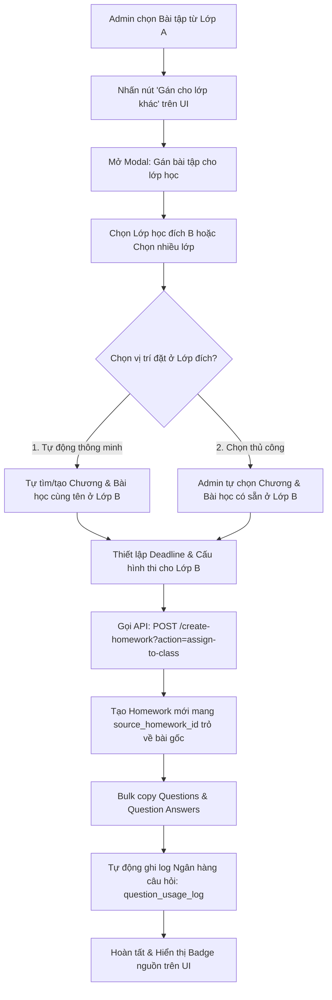
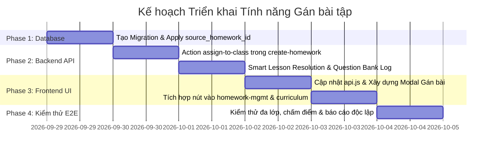

# 📋 KẾ HOẠCH TRIỂN KHAI: GÁN BÀI TẬP GIỮA CÁC LỚP HỌC (ASSIGN / CLONE HOMEWORK TO ANOTHER CLASS)

> **Mã tài liệu:** `PLAN-ASSIGN-HW-2026-09`  
> **Phiên bản:** `v1.0`  
> **Ngày lập:** `29/09/2026`  
> **Trạng thái:** `Sẵn sàng triển khai`

---

## 🔍 I. HIỆN TRẠNG KIẾN TRÚC & PHÂN TÍCH BÀI TOÁN

### 1. Mô hình phân cấp dữ liệu hiện tại
Hệ thống quản lý học tập & thi trực tuyến đang vận hành theo mô hình quan hệ phân cấp cây:
$$\text{Lớp học (classes)} \longrightarrow \text{Chương học (chapters)} \longrightarrow \text{Bài học (lessons)} \longrightarrow \text{Bài tập (homeworks)} \longrightarrow \text{Câu hỏi (questions)}$$

* **Bảng [`homeworks`](file:///home/hocnguyen/Documents/Projects/exam/supabase/sql/full_schema_export.sql#L60-L71):** Bắt buộc liên kết với 1 bài học qua khóa ngoại `lesson_id NOT NULL REFERENCES lessons(id) ON DELETE CASCADE`.
* **Bảng [`submissions`](file:///home/hocnguyen/Documents/Projects/exam/supabase/sql/full_schema_export.sql#L94-L105):** Gắn trực tiếp với `homework_id` và `student_id`.
* **Chính sách bảo mật RLS ([`20260801000000_initial_schema.sql`](file:///home/hocnguyen/Documents/Projects/exam/supabase/migrations/20260801000000_initial_schema.sql#L214-L235)):** Học sinh chỉ được phép đọc đề và nộp bài nếu `lesson_id` thuộc về `class_id` mà học sinh đó đang theo học.
* **Giao diện Lộ trình học ([`curriculum.js`](file:///home/hocnguyen/Documents/Projects/exam/fe/src/js/views/curriculum.js#L268-L325)):** Hiển thị danh sách bài tập theo từng cây Bài học $\rightarrow$ Chương học của lớp hiện hành.

### 2. Yêu cầu nghiệp vụ khi Gán bài tập sang lớp khác
1. **Lịch học & Thời hạn (Deadline) độc lập:** Các lớp học vào các buổi khác nhau trong tuần (ví dụ Lớp A học Thứ 2, Lớp B học Thứ 5) nên Deadline nộp bài của từng lớp phải độc lập.
2. **Tách biệt kết quả học sinh & Báo cáo thống kê:** Bảng điểm, tỷ lệ hoàn thành, danh sách chưa nộp bài ([`admin-history.js`](file:///home/hocnguyen/Documents/Projects/exam/fe/src/js/views/admin-history.js)) và phòng giám sát thi ([`exam-proctoring.js`](file:///home/hocnguyen/Documents/Projects/exam/fe/src/js/views/exam-proctoring.js)) phải thuộc về từng lớp riêng biệt, không được gộp lẫn học sinh của các lớp vào nhau.
3. **Toàn vẹn trải nghiệm học sinh:** Học sinh lớp đích khi truy cập lộ trình học tập của mình phải thấy bài tập nằm gọn trong đúng Bài học/Chương học tương ứng của lớp đó.

---

## ⚖️ II. ĐÁNH GIÁ & LỰA CHỌN PHƯƠNG ÁN KỸ THUẬT

| Tiêu chí so sánh | Phương án A: Deep Clone kèm Truy vết nguồn (`source_homework_id`) <br>⭐ **[ĐỀ XUẤT CHỌN]** | Phương án B: Chia sẻ bản ghi dùng chung N:N (`homework_class_assignments`) |
| :--- | :--- | :--- |
| **Bản chất kỹ thuật** | Nhân bản bài tập + câu hỏi + đáp án sang Bài học của Lớp đích, gắn cờ `source_homework_id` trỏ về bài gốc. | 1 bản ghi `homework_id` được gán cho nhiều lớp qua bảng liên kết trung gian. |
| **Độ độc lập dữ liệu** | **Tuyệt đối:** Dữ liệu bài làm `submissions`, chấm điểm và thống kê hoàn toàn độc lập theo từng lớp. | **Phức tạp:** Phải sửa bảng `submissions`, bổ sung `class_id`/`assignment_id` và viết lại logic lọc học sinh. |
| **Tùy biến cấu hình thi** | Tùy chỉnh **Deadline, Thời gian thi, Số lần làm lại, Trạng thái xuất bản** riêng cho từng lớp đích. | Phải lưu các trường ghi đè (override settings) vào bảng trung gian. |
| **Bảo mật RLS Database** | **Tương thích 100%:** Giữ nguyên toàn bộ RLS policies trên `homeworks`, `questions`, `submissions`. | **Phá vỡ:** Phải đập đi viết lại toàn bộ RLS policies trên 6 bảng liên quan. |
| **Mức độ rủi ro hệ thống** | **Rất thấp:** Không gây breaking change cho bất kỳ API hoặc màn hình nào đang hoạt động. | **Rất cao:** Nguy cơ phát sinh lỗi chéo ở `dashboard`, `admin-history`, `statistics`, `exam-room`. |
| **Chỉnh sửa đề sau khi thi** | Giáo viên sửa câu hỏi ở Lớp B không làm sai lệch điểm thi của học sinh Lớp A đã nộp bài trước đó. | Sửa 1 câu hỏi có thể làm sai lệch kết quả đã nộp của các lớp khác. |

> 🎯 **Kết luận:** Lựa chọn **Phương án A (Deep Clone with Source Traceability & Batch Assign)** — chuẩn kiến trúc LMS giáo dục hiện đại.

---

## 🏛️ III. KIẾN TRÚC & QUY TRÌNH HOẠT ĐỘNG (WORKFLOW)



---

## 🛠️ IV. CHI TIẾT THIẾT KẾ CÁC THÀNH PHẦN

### 1. Cơ sở dữ liệu (Database Migration)
* **Tệp migration:** `supabase/migrations/20260801000036_add_source_homework_id.sql`
* **Nội dung:**
  ```sql
  -- Bổ sung cột lưu vết bài tập gốc khi gán/sao chép giữa các lớp
  ALTER TABLE public.homeworks
    ADD COLUMN IF NOT EXISTS source_homework_id UUID REFERENCES public.homeworks(id) ON DELETE SET NULL;

  -- Index tăng tốc truy vấn tìm các bài tập sao chép từ một bài gốc
  CREATE INDEX IF NOT EXISTS idx_homeworks_source_hw_id 
    ON public.homeworks(source_homework_id) 
    WHERE source_homework_id IS NOT NULL;
  ```

---

### 2. Backend Edge Function (`create-homework`)
* **Tệp phụ trách:** [`supabase/functions/create-homework/index.ts`](file:///home/hocnguyen/Documents/Projects/exam/supabase/functions/create-homework/index.ts)
* **Action mới:** `POST /create-homework?action=assign-to-class`
* **Cấu trúc dữ liệu đầu vào (Payload):**
  ```typescript
  interface AssignHomeworkInput {
    sourceHomeworkId: string;
    targetClassIds: string[]; // Hỗ trợ gán 1 hoặc nhiều lớp cùng lúc
    targetLessonId?: string;  // Dùng khi chỉ định 1 bài học cụ thể
    smartMapping?: boolean;   // true = tự động tìm/tạo chương & bài học tương ứng
    customSettings?: {
      title?: string;
      deadline?: string | null;
      durationMinutes?: number;
      maxAttempts?: number;
      maxViolations?: number;
      isPublished?: boolean;
      showSolutions?: boolean;
    };
  }
  ```

* **Quy trình xử lý nội bộ (Transactional Steps):**
  1. **Xác thực quyền hạn:** Kiểm tra `requireAdmin(req)`.
  2. **Truy vấn bài tập nguồn:**
     * Lấy dữ liệu `homeworks` gốc.
     * Lấy bài học (`lesson`) và chương (`chapter`) gốc để biết tên chương/bài.
     * Lấy toàn bộ `questions` và `question_answers` tương ứng.
  3. **Lặp qua từng Lớp đích (`targetClassId`):**
     * **Xác định `target_lesson_id`:**
       * *Nếu có `targetLessonId` cụ thể:* Kiểm tra tính hợp lệ thuộc lớp đích.
       * *Nếu `smartMapping = true`:*
         * Tìm `chapters` trong lớp đích có `title = sourceChapterTitle`. Nếu chưa có $\rightarrow$ `INSERT` chương mới.
         * Tìm `lessons` trong chương đó có `title = sourceLessonTitle`. Nếu chưa có $\rightarrow$ `INSERT` bài học mới.
         * Lấy `lesson_id` vừa tìm/tạo.
     * **Tạo bản ghi `homeworks` mới:**
       * Gán `lesson_id = target_lesson_id`.
       * Gán `source_homework_id = sourceHomeworkId`.
       * Kế thừa cấu hình bài gốc hoặc áp dụng `customSettings` (deadline, thời gian thi, số lần làm...).
     * **Bulk Insert `questions` & `question_answers`:**
       * Copy toàn bộ câu hỏi, loại câu, điểm, mức độ nhận thức, `content`, `options`, `statements`, `part_title`, `question_bank_id`.
       * Copy toàn bộ đáp án tương ứng vào `question_answers`.
     * **Tích hợp Ngân hàng câu hỏi (`question_usage_log`):**
       * Thu thập tất cả `question_bank_id` của các câu hỏi.
       * Gọi RPC `fn_bump_qb_usage_with_log(p_question_ids, targetClassId, newHomeworkId)` để cập nhật lịch sử câu hỏi đã được dùng ở lớp mới.

---

### 3. Tầng API Client Frontend (`fe/src/js/api.js`)
* **Tệp phụ trách:** [`fe/src/js/api.js`](file:///home/hocnguyen/Documents/Projects/exam/fe/src/js/api.js)
* **Hàm bổ sung:**
  ```javascript
  assignHomeworkToClass: (data) => 
    request('create-homework?action=assign-to-class', {
      method: 'POST',
      body: JSON.stringify(data)
    })
  ```

---

### 4. Giao diện người dùng (Frontend UI/UX)

#### A. Điểm kích hoạt trên giao diện (Trigger Points)
1. **Quản lý bài tập & bài thi ([`homework-mgmt.js`](file:///home/hocnguyen/Documents/Projects/exam/fe/src/js/views/homework-mgmt.js)):**
   * Bổ sung nút thao tác **"Gán cho lớp khác"** (Icon `<i class="fa-solid fa-share-nodes"></i>` hoặc `<i class="fa-solid fa-copy"></i>`) vào cột *Thao tác* trên mỗi dòng bài tập.
   * Hiển thị Badge `[Gán từ: Lớp 12A1]` kèm tooltip nếu bài tập có `source_homework_id`.
2. **Lộ trình chương trình học ([`curriculum.js`](file:///home/hocnguyen/Documents/Projects/exam/fe/src/js/views/curriculum.js)):**
   * Bổ sung nút hành động "Gán sang lớp khác" trong phần danh sách bài tập của từng bài học.
3. **Màn hình tạo/sửa bài tập ([`create-hw.js`](file:///home/hocnguyen/Documents/Projects/exam/fe/src/js/views/create-hw.js)):**
   * Thêm tùy chọn "Đồng thời gán cho các lớp khác" khi lưu bài mới.

#### B. Thiết kế Modal "Gán bài tập cho lớp học" (`modal-assign-homework`)
Modal gồm 4 khối trực quan:
* **Khối 1: Thông tin bài tập gốc:** Hiển thị tên bài, loại bài (Luyện tập/Bài thi), số lượng câu hỏi, lớp hiện tại.
* **Khối 2: Chọn lớp học đích:** Dropdown/Checkbox cho phép chọn 1 hoặc nhiều lớp đích (tự động ẩn lớp gốc).
* **Khối 3: Vị trí gán trong lớp đích:**
  * 🔘 *Tự động (Mặc định - Khuyên dùng):* Tự động tạo/ghép vào Chương và Bài học cùng tên ở lớp đích.
  * 🔘 *Thủ công:* Chọn cụ thể Chương đích $\rightarrow$ Bài học đích.
* **Khối 4: Cấu hình riêng cho lớp đích:**
  * Hạn chót nộp bài (Deadline) riêng.
  * Thời gian làm bài (Phút), Số lần làm lại.
  * Trạng thái: Xuất bản ngay hay Lưu nháp.

---

## 🛡️ V. XỬ LÝ CÁC TRƯỜNG HỢP BIÊN (EDGE CASES)

| Tình huống biên | Cách xử lý hệ thống |
| :--- | :--- |
| **Lớp đích chưa có Chương/Bài học nào** | Chế độ Tự động sẽ tự động tạo Chương 1 và Bài học 1 tương ứng với bài gốc, không bị lỗi dữ liệu mồ côi. |
| **Trùng tên bài tập trong cùng bài học của lớp đích** | Hệ thống tự động thêm hậu tố `(Bản sao)` vào tiêu đề bài tập mới để tránh trùng lặp gây nhầm lẫn. |
| **Bài tập gốc là Bài thi chính thức (EXAM)** | Kế thừa cấu hình chống gian lận (`max_violations`, `duration_minutes`). Phòng thi giám sát của lớp mới hoàn toàn độc lập với lớp gốc. |
| **Học sinh học đồng thời cả 2 lớp** | Mỗi lớp có một bản ghi `homework_id` riêng, học sinh nộp bài độc lập ở từng lớp mà không bị ghi đè kết quả. |
| **Xóa bài tập gốc sau khi đã gán** | Khóa ngoại `ON DELETE SET NULL` giúp bài tập ở lớp đích vẫn hoạt động bình thường, trường `source_homework_id` tự động về `NULL`. |

---

## 📅 VI. LỘ TRÌNH TRIỂN KHAI & CHECKLIST CÔNG VIỆC



### ✅ Checklist công việc chi tiết:
- [ ] **Phase 1 (Database):**
  - [ ] Tạo `supabase/migrations/20260801000036_add_source_homework_id.sql`.
  - [ ] Chạy migration cập nhật bảng `homeworks` và chỉ mục.
- [ ] **Phase 2 (Backend Edge Function):**
  - [ ] Thêm xử lý `action === 'assign-to-class'` trong [`create-homework/index.ts`](file:///home/hocnguyen/Documents/Projects/exam/supabase/functions/create-homework/index.ts).
  - [ ] Triển khai thuật toán Smart Lesson Resolution (tự tìm/tạo Chương & Bài).
  - [ ] Bulk copy câu hỏi, đáp án và gọi `fn_bump_qb_usage_with_log`.
- [ ] **Phase 3 (Frontend Integration):**
  - [ ] Bổ sung hàm `assignHomeworkToClass` vào [`fe/src/js/api.js`](file:///home/hocnguyen/Documents/Projects/exam/fe/src/js/api.js).
  - [ ] Thêm nút thao tác và xây dựng Modal gán bài trong [`fe/src/js/views/homework-mgmt.js`](file:///home/hocnguyen/Documents/Projects/exam/fe/src/js/views/homework-mgmt.js).
  - [ ] Thêm nút thao tác trong [`fe/src/js/views/curriculum.js`](file:///home/hocnguyen/Documents/Projects/exam/fe/src/js/views/curriculum.js).
  - [ ] Bổ sung hiển thị Badge nguồn gốc bài tập gán.
- [ ] **Phase 4 (Kiểm thử & Bàn giao):**
  - [ ] Gán bài tập từ Lớp A sang Lớp B với Deadline khác nhau.
  - [ ] Đăng nhập tài khoản học sinh Lớp B $\rightarrow$ làm bài và nộp bài.
  - [ ] Kiểm tra bảng điểm [`admin-history.js`](file:///home/hocnguyen/Documents/Projects/exam/fe/src/js/views/admin-history.js) của Lớp A và Lớp B tách biệt hoàn toàn.

---

## 🧪 VII. MA TRẬN KIỂM THỬ (TEST CASES)

| Mã test | Mô tả kịch bản | Kết quả kỳ vọng |
| :---: | :--- | :--- |
| **TC-01** | Gán bài tập sang Lớp B bằng chế độ *Tự động (Smart Mapping)* khi Lớp B chưa có chương/bài. | Lớp B tự động được tạo Chương & Bài cùng tên, bài tập xuất hiện đúng vị trí. |
| **TC-02** | Gán bài tập sang Lớp B bằng chế độ *Thủ công* (chỉ định 1 bài học có sẵn). | Bài tập gắn đúng vào `lesson_id` đã chọn trong Lớp B. |
| **TC-03** | Đặt Deadline mới cho Lớp B khi gán bài. | Lớp B nhận đúng Deadline mới, không ảnh hưởng Deadline của Lớp A. |
| **TC-04** | Gán đồng thời cho 3 lớp (Batch assign). | Cả 3 lớp đều nhận được bài tập độc lập tương ứng. |
| **TC-05** | Học sinh Lớp B vào làm bài và nộp bài. | Điểm số và bài làm chỉ hiển thị trong báo cáo của Lớp B, Lớp A giữ nguyên trạng thái. |
| **TC-06** | Xóa bài tập ở Lớp A sau khi đã gán cho Lớp B. | Bài tập ở Lớp B vẫn hoạt động bình thường, `source_homework_id` chuyển về `NULL`. |
