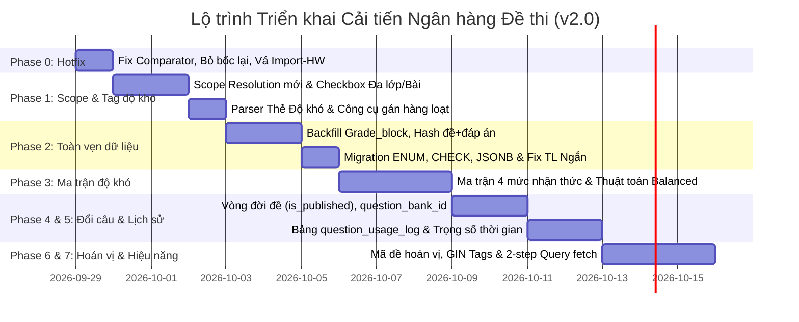

# 📋 KẾ HOẠCH HỢP NHẤT CẢI TIẾN NGÂN HÀNG ĐỀ THI (QUESTION BANK)

> **Căn cứ:** Tài liệu mô tả kiến trúc `question_bank`, kết quả đối chiếu mã nguồn thực tế và đóng góp hiệu chỉnh quy trình (v2.0 - 28/09/2026).

---

## 🔍 PHẦN I: BÁO CÁO XÁC MINH MÃ NGUỒN HIỆN TẠI (BƯỚC 0)

| STT | Hạng mục kỹ thuật | Kết quả đối chiếu mã nguồn thực tế | Quyết định kỹ thuật |
| :---: | :--- | :--- | :--- |
| **1** | **Xử lý Scope & Câu mồ côi** | `question-bank/index.ts:799-804` dùng `.or(grade_block.eq..., class_id.in...)`. Câu có `class_id/chapter_id IS NULL` nhưng có `grade_block` vẫn vào pool `BLOCK`. | Mỗi cấp chỉ lọc theo cột của chính nó. Tách bộ lọc chưa phân loại thành 3 trạng thái: Chưa có lớp, Chưa có chương, Chưa có bài (Phase 1). |
| **2** | **Luồng chốt đề thi** | FE ([`question-bank.js:2017`](file:///home/hocnguyen/Documents/Projects/exam/fe/src/js/views/question-bank.js#L2017)) **đã dùng `create-from-selected` và truyền đúng `questionBankIds`**. Tuy nhiên BE `generate-exam` vẫn còn nhánh bốc lại nếu `previewOnly=false`. | **Không tạo endpoint mới**. Nâng cấp `create-from-selected` và gỡ bỏ hoàn toàn nhánh bốc lại trong `generate-exam` (Phase 0). |
| **3** | **Kiểm tra trùng khi Import** | [`index.ts:594-608`](file:///home/hocnguyen/Documents/Projects/exam/supabase/functions/question-bank/index.ts#L594-L608): Kéo toàn bộ cột `prompt` của cả bảng vào RAM và so sánh 100 ký tự đầu (`slice(0, 100)`). Rất tốn RAM và dễ loại nhầm câu khác nhau có cùng mở đầu. | **Vá nhanh ngay Phase 0**: Lọc theo `grade_block`, so sánh chuỗi chuẩn hóa đầy đủ. Chuyển sang `content_hash` SHA-256 ở Phase 2. |
| **4** | **Lưu trữ & Parse `prompt`** | Cột `prompt` là kiểu `TEXT`. Cả FE ([`question-bank.js:653`](file:///home/hocnguyen/Documents/Projects/exam/fe/src/js/views/question-bank.js#L653)) và BE ([`index.ts:85`](file:///home/hocnguyen/Documents/Projects/exam/supabase/functions/question-bank/index.ts#L85)) đang phải chạy vòng lặp `while (unwrapCount < 3)` để gỡ stringified JSON lồng nhau. | Chuyển sang kiểu **`JSONB`** native; thống nhất module chuẩn hóa dữ liệu (Phase 2). |
| **5** | **Phân quyền & Bảo mật** | Edge Function chặn bằng `requireAuth` + `user.role === 'ADMIN'`. RLS trên bảng `question_bank` chỉ cho phép `service_role` và `is_admin()`. Học sinh không thể đọc ngân hàng. | Bảo mật đạt yêu cầu. Duy trì cơ chế hiện tại. |
| **6** | **Chỉ số `usage_count` & Vòng đời** | `usage_count` tăng ngay khi gọi `create-from-selected`. Chưa từng có cơ chế hoàn tác (unbump). Bảng `questions` chưa lưu `question_bank_id` nên đề cũ không truy vết ngược được. | Đề cũ mang `question_bank_id = NULL`, mặc định đã xuất bản và không hỗ trợ unbump. Đề mới lưu `question_bank_id` và hỗ trợ unbump (Phase 4). |
| **7** | **Chấm điểm Đúng/Sai & TL Ngắn** | - Câu Đúng/Sai: [`grading-service.ts:3-9`](file:///home/hocnguyen/Documents/Projects/exam/supabase/shared/grading-service.ts#L3-L9) đã đạt chuẩn BGD 2025 (0.1, 0.25, 0.5, 1.0).<br>- Câu TL Ngắn: `normalizeShortAnswer()` chỉ mới đổi dấu `,` thành `.`, **chưa xử lý phân số (7/2) và dấu trừ Unicode (`−`, `–`)**. | Đạt chuẩn Đúng/Sai 2025. Cần bổ sung xử lý phân số & dấu trừ Unicode cho `normalizeShortAnswer()` (Phase 2). |

---

## 📅 PHẦN II: LỘ TRÌNH VÀ CHI TIẾT TỪNG PHASE



---

### Phase 0: Hotfix Thuật toán, Chặn bốc lại & Vá Import-HW (Ưu tiên: CAO - Thời gian: 1 ngày)

#### 0.1 Sửa comparator của `pickRandomWeighted`
- **Vấn đề:** Gọi `Math.random()` trực tiếp trong comparator của `.sort()` vi phạm hợp đồng toán học của `Array.prototype.sort`, khiến phân phối ngẫu nhiên bị méo mó.
- **Giải pháp:** Tính trước `sortKey` 1 lần cho mỗi câu trước khi sắp xếp:
  ```typescript
  const NOISE = 0.8 // Giữ phân tầng cứng: câu usage=0 luôn ưu tiên hơn usage=1
  const pickRandomWeighted = (pool: any[], count: number) => {
    if (count <= 0) return []
    return pool
      .map(q => ({ q, sortKey: (q.usage_count || 0) + Math.random() * NOISE }))
      .sort((a, b) => a.sortKey - b.sortKey)
      .slice(0, count)
      .map(x => x.q)
  }
  ```

#### 0.2 Nâng cấp `create-from-selected` & Chặn nhánh bốc lại trong `generate-exam` `[ĐÃ HOÀN THÀNH]`
- [x] **Nguyên tắc:** Giao diện FE dùng `create-from-selected` để truyền danh sách `questionBankIds` đã duyệt ở Preview $\rightarrow$ Không thêm endpoint `finalize-exam` thừa thãi.
- [x] **Nâng cấp `create-from-selected`**:
  - Xác thực số lượng câu theo từng dạng (MC, TF, SA) khớp với yêu cầu đề thi.
  - Bảo toàn tuyệt đối thứ tự mảng `questionBankIds` do FE gửi lên.
  - Kiểm tra các câu hỏi thuộc đúng quyền hạn quản trị.
- [x] **Trong `generate-exam`**:
  - Chặn nhánh bốc lại khi `previewOnly: false`.

#### 0.3 `swap-question` ghi nhớ các câu đã loại `[ĐÃ HOÀN THÀNH]`
- [x] Modal phía FE duy trì mảng `rejectedIds` trong suốt phiên làm việc.
- [x] Gửi `excludeIds = [...câu đang hiển thị trên đề, ...rejectedIds]`.
- [x] Khi kho hết ứng viên thay thế thỏa mãn điều kiện, trả mã lỗi rõ ràng `NO_MORE_CANDIDATES` để hiển thị thông báo thay vì bốc lại câu cũ.

#### 0.4 Vá khẩn cấp hiệu năng `import-from-homework` `[ĐÃ HOÀN THÀNH]`
- [x] Chỉ `SELECT id, prompt` có lọc theo `grade_block` của các bài tập đích.
- [x] Chuẩn hóa toàn bộ chuỗi văn bản (bỏ khoảng trắng thừa, lowercase) thay vì cắt ngắn `slice(0, 100)`.

---

### Phase 1: Scope Resolution thế hệ mới, Parser Thẻ Độ khó & Công cụ Gán hàng loạt (Ưu tiên: CAO) `[ĐÃ HOÀN THÀNH]`

#### 1.1 Hợp đồng API Scope mới `[x]`
```jsonc
POST question-bank?action=generate-exam
{
  "previewOnly": true,
  "scope": {
    "gradeBlock": "11-Hóa",               // Bắt buộc
    "classIds":   ["uuid-1", "uuid-2"],   // Tùy chọn (rỗng = mọi lớp trong khối)
    "chapterIds": ["uuid-ch1"],           // Tùy chọn
    "lessonIds":  ["uuid-l1", "uuid-l2"]  // Tùy chọn
  },
  "matrix": { "MULTIPLE_CHOICE": 12, "TRUE_FALSE": 4, "SHORT_ANSWER": 6 }
}
```
*Tương thích ngược: Adapter `normalizeScopeInput()` ở đầu Edge Function tự chuyển đổi linh hoạt cả 2 định dạng request dạng phẳng cũ `{ scopeType, classId... }` và object `{ scope }`.*

#### 1.2 Hàm `buildPoolQuery(scope, type)` & Xử lý câu mồ côi nhất quán `[x]`
- **Nguyên tắc phân tầng độc lập**: Mỗi cấp chỉ lọc theo đúng cột của chính nó:
  - Scope Bài học: lọc theo `lesson_id = ANY(lessonIds)`.
  - Scope Chương: lọc theo `chapter_id = ANY(chapterIds)` (câu có `chapter_id` nhưng `lesson_id IS NULL` vẫn hợp lệ).
  - Scope Lớp học: lọc theo `class_id = ANY(classIds)` (câu có `class_id` nhưng `chapter_id IS NULL` vẫn hợp lệ).
  - Scope Khối: lọc theo `grade_block = gradeBlock` (câu chưa phân lớp/chương/bài vẫn vào pool khối).

#### 1.3 Giao diện Modal Ma trận đa lựa chọn `[x]`
- Cấu trúc cây chọn lọc: Khối $\rightarrow$ Danh sách Lớp (Checkboxes) $\rightarrow$ Danh sách Chương (Expand on demand) $\rightarrow$ Danh sách Bài (Checkboxes).
- Hỗ trợ 2 chế độ: Chế độ 1 cấp nhanh (`QUICK`) và Chế độ Cây phân cấp (`MULTI`).
- **Live Availability Badge**: Hiển thị số lượng câu khả dụng (TN / ĐS / TLN) theo thời gian thực bên cạnh từng dạng câu hỏi và thanh tổng quan.
- **Cảnh báo thiếu hụt tức thời (Deficit Alert)**: Đổi màu đỏ cảnh báo kèm số lượng câu bị thiếu `(Thiếu X câu)` ngay cạnh ô nhập số lượng và trên badge khả dụng.

#### 1.4 Bộ lọc "Chưa phân loại" đa trạng thái `[x]`
Phân tách rõ 3 trạng thái câu hỏi chưa hoàn thiện danh mục cả trên giao diện FE (`#qb-filter-unassigned`) và Edge Function query:
1. Chưa gán lớp: `class_id IS NULL` (`no_class`)
2. Chưa gán chương: `chapter_id IS NULL` (`no_chapter`)
3. Chưa gán bài: `lesson_id IS NULL` (`no_lesson`)

#### 1.5 Bóc tách thẻ Mức độ nhận thức từ Markdown (`exam-parser.js`) `[x]`
- Đã nâng cấp Regex & Tokenizer nhận diện đầy đủ các thẻ độ khó trên tiêu đề câu hỏi:
  - `[NHAN_BIET]` hoặc `[NB]` $\rightarrow$ `NHAN_BIET` (Nhận biết)
  - `[THONG_HIEU]` hoặc `[TH]` $\rightarrow$ `THONG_HIEU` (Thông hiểu)
  - `[VAN_DUNG]` hoặc `[VD]` $\rightarrow$ `VAN_DUNG` (Vận dụng)
  - `[VAN_DUNG_CAO]` hoặc `[VDC]` $\rightarrow$ `VAN_DUNG_CAO` (Vận dụng cao)
- Hỗ trợ linh hoạt thứ tự thẻ ở cả 3 dạng:
  - Trắc nghiệm: `[Câu 1] [NHAN_BIET]`
  - Đúng / Sai: `[Câu 5] [TF] [THONG_HIEU]` hoặc `[Câu 5] [THONG_HIEU] [TF]`
  - Trả lời ngắn: `[Câu 7] [SA] [VAN_DUNG]` hoặc `[Câu 7] [VAN_DUNG] [SA]`
- Đã bổ sung xem trước & gán nhanh độ khó từng câu ngay trong Modal Import Markdown trước khi lưu.

#### 1.6 Công cụ Gán độ khó hàng loạt (Bulk Difficulty Assignment) `[x]`
- **Giao diện FE:** Checkbox chọn câu hỏi ở từng card, Checkbox "Chọn tất cả trên trang này", thanh tác vụ nổi (Sticky Bulk Toolbar) hiển thị số câu đã chọn kèm Dropdown chọn độ khó và nút "Áp dụng hàng loạt".
- **Backend API:** `PUT /question-bank` hỗ trợ mảng `ids: string[]` cập nhật độ khó hàng loạt trong 1 truy vấn duy nhất.

---

### Phase 2: Toàn vẹn dữ liệu, Hash chống trùng & Chuẩn hóa JSONB (Ưu tiên: CAO) `[ĐÃ HOÀN THÀNH]`

#### 2.1 Thứ tự Migration an toàn tuyệt đối `[x]`
Đã thực thi migration an toàn `20260801000034_question_bank_phase2_integrity.sql` đồng bộ lên remote Supabase:
1. [x] **Bước 1:** Đã unwrap sạch toàn bộ 34 câu hỏi có chuỗi JSON lồng nhau trong cột `prompt`.
2. [x] **Bước 2 (Backfill grade_block):** 100% dòng có `grade_block` hợp lệ (không còn giá trị NULL).
3. [x] **Bước 3 (Tìm & Sửa dữ liệu vi phạm):** Dọn sạch 44 câu Đúng/Sai có `sa_answer` và 25 câu Trả lời ngắn có `tf_answers`.
4. [x] **Bước 4 (Tính toán `content_hash`):**
   - Tạo hàm `fn_compute_qb_content_hash(question_type, prompt)` băm đề + phương án (bỏ qua ảnh và lời giải).
   - Đã tính toán và cập nhật `content_hash` cho 100% câu hỏi trong ngân hàng.
5. [x] **Bước 5 (Xử lý trùng lặp):** Đã lọc và xóa sạch 134 bản ghi trùng lặp (giữ lại bản ghi ưu tiên có `usage_count` cao nhất, có `lesson_id`).
6. [x] **Bước 6 (Tạo Constraint & Index):**
   - Đã tạo ENUM `qb_difficulty` ('NHAN_BIET', 'THONG_HIEU', 'VAN_DUNG', 'VAN_DUNG_CAO').
   - Đã tạo CHECK constraint `chk_qb_answer_by_type` bảo đảm tính nhất quán của đáp án.
   - Đã tạo Unique Index `uq_qb_block_hash ON public.question_bank (grade_block, content_hash) WHERE content_hash IS NOT NULL`.
7. [x] **Bước 7 (Chuyển sang `JSONB` native):**
   - Cột `prompt` đã chuyển sang kiểu native `JSONB`.
   - Edge Function `question-bank` đã chuyển sang nhận và trả JSON object trực tiếp không qua double-stringification.

#### 2.2 Nâng cấp `normalizeShortAnswer` trong `grading-service.ts` & `scoring-engine.js` `[x]`
- [x] Hỗ trợ đổi dấu phẩy `,` thành `.`.
- [x] Hỗ trợ phân số dạng chuỗi `a/b` (ví dụ: `7/2` $\rightarrow$ `3.5`, `10/4` $\rightarrow$ `2.5`).
- [x] Hỗ trợ các ký tự dấu trừ Unicode: `−` (`\u2212`), `–` (`\u2013`), `—` (`\u2014`).
- [x] Đã kiểm thử tự động 100% pass trên cả server và client.

#### 2.3 Bảo vệ danh mục chống mồ côi dữ liệu & Triggers `[x]`
- [x] Đã tạo 3 Triggers `trg_check_delete_classes_qb`, `trg_check_delete_chapters_qb`, `trg_check_delete_lessons_qb` chặn xóa danh mục khi có câu hỏi ngân hàng đang trỏ tới.
- [x] Trigger `trg_qb_before_insert_or_update` tự động đồng bộ `grade_block` từ `classes`, tự động tính toán `content_hash` và chuẩn hóa đáp án trước khi lưu.

---

### Phase 3: Ma trận độ khó & Thuật toán Cân bằng (Balanced & SourceMix) `[x]` (Hoàn thành)

#### 3.1 Ma trận độ khó (`byDifficulty`) `[x]`
- [x] Cấu hình chi tiết ma trận 4 mức nhận thức (`NHAN_BIET`, `THONG_HIEU`, `VAN_DUNG`, `VAN_DUNG_CAO`) cho từng phần (MC, TF, SA).
- [x] Bốc độc lập theo từng ô (Dạng câu $\times$ Mức độ) kết hợp `pickRandomWeighted`.
- [x] Cơ chế bù mượn thông minh (`shortage: 'borrow'`): Tự động mượn từ mức độ thấp hơn liền kề và hiển thị cảnh báo `borrowAlerts` trên Preview.
- [x] Chế độ nghiêm ngặt (`shortage: 'error'`): Báo lỗi chính xác ô nào bị thiếu và số lượng câu còn thiếu.
- [x] Giao diện người dùng: Accordion mở rộng cấu hình chi tiết 4 mức độ kèm chip hiển thị số lượng câu khả dụng tức thời (`res.byTypeAndDifficulty`).

#### 3.2 Thuật toán phân bổ đều `balanced` `[x]`
- [x] Chia đều chỉ tiêu câu hỏi cho $k$ nhóm chương/bài được chọn ($N / k$).
- [x] Cơ chế Quỹ bù trừ (Compensation Pool): Chuyển phần thiếu từ các bài ít câu sang các bài còn dư câu hỏi trong cùng phạm vi.

#### 3.3 Trộn tỷ lệ nguồn `sourceMix` giữa các lớp `[x]`
- [x] Cho phép ra đề kết hợp theo tỷ lệ trọng số giữa các lớp (ví dụ 70% Cơ bản + 30% Nâng cao).
- [x] Thuật toán phần dư lớn nhất (Largest Remainder Method) làm tròn số lượng câu nguyên vẹn và công bằng.

---

### Phase 4: Quản lý Vòng đời đề thi & Đổi câu thông minh `[x]` (Hoàn thành)

#### 4.1 Tái sử dụng trạng thái hiện có & Truy vết câu hỏi `[x]`
- [x] Đã bổ sung cột `question_bank_id UUID REFERENCES question_bank(id) ON DELETE SET NULL` vào bảng `questions` (Migration 35).
- [x] Đề cũ mang `question_bank_id = NULL`, mặc định an toàn không bị ảnh hưởng.
- [x] Khi tạo đề (`create-from-selected`), tự động lưu `question_bank_id` cho từng câu hỏi.
- [x] Tích hợp vòng đời `homeworks.is_published`: Đề xuất bản mới tăng `usage_count`; đề nháp đổi/xóa tự do không tăng.
- [x] Chặn đổi câu khi đề đã khóa (`LOCKED`): Kiểm tra `submissions` của đề thi; nếu $> 0$ học sinh đã nộp bài, chặn thao tác đổi câu để bảo toàn điểm số.

#### 4.2 Đổi câu có ràng buộc (Smart Swap) `[x]`
- [x] Hỗ trợ tham số `sameDifficulty: true` và `sameChapter: true`.
- [x] Trả về danh sách 3 ứng viên phù hợp nhất (`candidates: topCandidates`).
- [x] Giao diện người dùng: Nút "Đổi nhanh" (giữ cùng mức độ) và nút "3 gợi ý" (mở modal trực quan để giáo viên tự chọn câu thay thế phù hợp).

---

### Phase 5: Lịch sử sử dụng theo lớp & Trọng số thời gian `[x]` (Hoàn thành)

#### 5.1 Bảng lịch sử `question_usage_log` `[x]`
- [x] Đã tạo bảng `public.question_usage_log` (Migration 35) lưu `(question_id, class_id, homework_id, used_at)`.
- [x] Đã tạo index tối ưu: `idx_qul_question`, `idx_qul_class`, `idx_qul_hw`.
- [x] Tạo RPC nguyên tử `fn_bump_qb_usage_with_log` và `fn_unbump_qb_usage_with_log`.

#### 5.2 Công thức tính điểm ưu tiên đa nhân tố `[x]`
- [x] Đã hiện thực công thức đa nhân tố trong `generate-exam`:
  $$\text{sortKey} = 3.0 \cdot \text{uses}_{\text{class}} + 1.0 \cdot \text{usage\_count} + \text{recency\_penalty} + \text{random} \cdot \text{NOISE}$$
- [x] Phạt nặng (+10.0) nếu câu vừa dùng trong vòng 7 ngày cho lớp này, phạt vừa (+5.0) nếu dùng trong 30 ngày qua.
- [x] Đảm bảo câu hỏi được xoay vòng tươi mới giữa các lớp khác nhau.

---

### Phase 6 & Phase 7: Hoán vị mã đề, GIN Tags & Tối ưu hiệu năng `[x]` (Hoàn thành)

#### 6.1 Hoán vị mã đề (101, 102...) `[x]`
- [x] Hàm `shuffleVariantQuestions()` hoán vị thứ tự câu trong từng phần và hoán vị phương án A/B/C/D.
- [x] Tự động tính toán lại đáp án đúng `mc_answer` tương ứng sau khi hoán vị và lưu `option_maps`.
- [x] Tôn trọng cờ `no_shuffle_options` và tự động phát hiện phương án đặc biệt ("Cả A và B đúng", "Tất cả đều đúng") để không xáo trộn.
- [x] Checkbox "Tự động tạo 4 mã đề hoán vị (101, 102, 103, 104)" trên giao diện tạo đề.

#### 6.2 Lọc theo Tags chuyên đề `[x]`
- [x] Đã tạo GIN Index: `CREATE INDEX IF NOT EXISTS idx_qb_tags ON public.question_bank USING GIN (tags);` (Migration 35).
- [x] Hỗ trợ lọc câu hỏi theo tags trong `buildPoolQuery()` với toán tử `contains`.

#### 6.3 Tối ưu truy vấn 2 bước (2-step query) `[x]`
- [x] **Bước 1:** Chỉ tải metadata nhẹ (`id, question_type, difficulty, usage_count, chapter_id, lesson_id, class_id`) để bốc câu.
- [x] **Bước 2:** Sau khi bốc xong $N$ câu trúng tuyển, chỉ tải đầy đủ `prompt`, `options`, `statements`, `explanation` cho các câu đó.
- [x] Giảm trên 90% băng thông mạng và mức tiêu thụ RAM của Edge Function.

