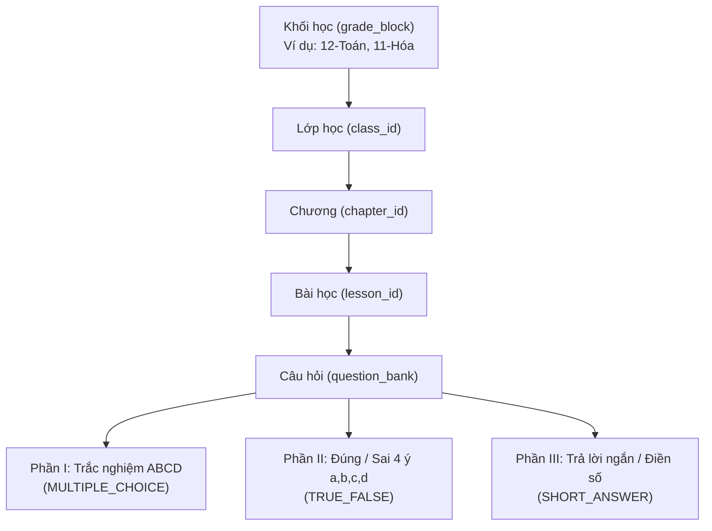
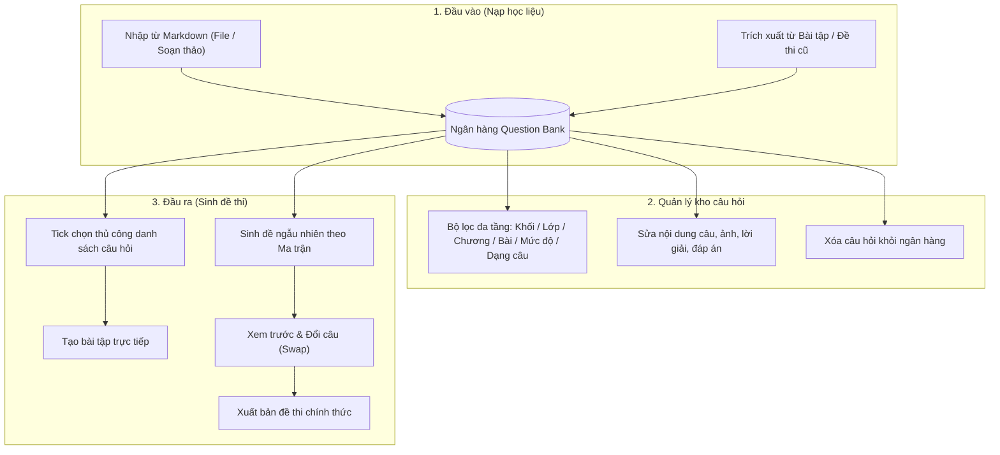
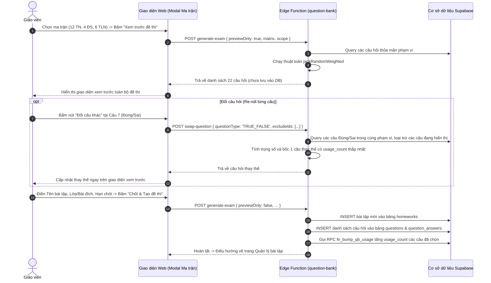

# 📚 TÀI LIỆU MÔ TẢ KIẾN TRÚC & THUẬT TOÁN NGÂN HÀNG ĐỀ THI (QUESTION BANK)

> **Mục đích:** Cung cấp bức tranh toàn cảnh về mô hình dữ liệu, các luồng nghiệp vụ nạp/quản lý câu hỏi và thuật toán bốc đề ngẫu nhiên theo ma trận để phục vụ công tác rà soát, đánh giá và nâng cấp hệ thống.

---

## I. MÔ HÌNH DỮ LIỆU & PHÂN TẦNG DANH MỤC

### 1. Sơ đồ phân cấp thực thể
Ngân hàng câu hỏi được tổ chức phân tầng từ cấp Khối học dùng chung đến từng Bài học cụ thể:



### 2. Cấu trúc bảng `public.question_bank`
Bảng lưu trữ được tối ưu hóa cho việc tìm kiếm, phân loại và truy vấn ngẫu nhiên:

| Tên trường | Kiểu dữ liệu | Ràng buộc / Mặc định | Ý nghĩa & Vai trò |
| :--- | :--- | :--- | :--- |
| `id` | `UUID` | `PRIMARY KEY, DEFAULT gen_random_uuid()` | Định danh duy nhất của câu hỏi trong ngân hàng |
| `subject` | `TEXT` | `NOT NULL DEFAULT 'TOAN'` | Môn học (`TOAN`, `HOA_HOC`...) |
| `grade_level` | `INT` | `NOT NULL DEFAULT 12` | Khối lớp (10, 11, 12) |
| `grade_block` | `TEXT` | `NULL` (Có Index) | Khối chuyên môn dùng chung (`12-Toán`, `11-Hóa`...) |
| `class_id` | `UUID` | `REFERENCES classes(id) ON DELETE SET NULL` | Lớp học trực thuộc |
| `chapter_id` | `UUID` | `REFERENCES chapters(id) ON DELETE SET NULL` | Chương học trực thuộc |
| `lesson_id` | `UUID` | `REFERENCES lessons(id) ON DELETE SET NULL` | Bài học trực thuộc |
| `question_type` | `ENUM` | `NOT NULL` | Dạng câu: `MULTIPLE_CHOICE`, `TRUE_FALSE`, `SHORT_ANSWER` |
| `difficulty` | `TEXT` | `DEFAULT 'THONG_HIEU'` | Mức độ nhận thức: `NHAN_BIET`, `THONG_HIEU`, `VAN_DUNG`, `VAN_DUNG_CAO` |
| `prompt` | `TEXT` | `NOT NULL` | Cấu trúc JSON chứa: đề bài Markdown, công thức LaTeX, ảnh, phương án, lời giải |
| `mc_answer` | `TEXT` | `NULL` | Đáp án đúng cho câu trắc nghiệm (`A`, `B`, `C`, hoặc `D`) |
| `tf_answers` | `JSONB` | `NULL` | Đáp án đúng/sai 4 ý: `{"a": true, "b": false, "c": true, "d": true}` |
| `sa_answer` | `TEXT` | `NULL` | Đáp án trả lời ngắn (số thực, phân số, chuỗi số) |
| `sa_tolerance` | `NUMERIC`| `DEFAULT 0.00` | Dung sai chấp nhận sai số khi chấm |
| `points` | `NUMERIC` | `DEFAULT 0.25` | Điểm số đề xuất cho câu hỏi |
| `tags` | `TEXT[]` | `DEFAULT '{}'` | Danh sách tag từ khóa chuyên đề (ví dụ: `["este", "đạo hàm"]`) |
| `usage_count` | `INT` | `DEFAULT 0` (Có Index) | **Số lần câu hỏi đã được chọn vào đề thi** (dùng cho thuật toán xoay vòng) |
| `created_at` | `TIMESTAMPTZ` | `DEFAULT NOW()` | Thời điểm nạp câu hỏi |
| `updated_at` | `TIMESTAMPTZ` | `DEFAULT NOW()` | Thời điểm chỉnh sửa gần nhất |

---

## II. CÁC LUỒNG CHỨC NĂNG NGHIỆP VỤ HIỆN CÓ



### 1. Nạp câu hỏi từ file Markdown (`action=import`)
* **Hỗ trợ cú pháp chuẩn**:
  - Tự động tách `[Câu 1]`, `Câu 1:`, `[A]`, `[B]`, `[C]`, `[D]`.
  - Hỗ trợ công thức Toán $\LaTeX$ (`$...$`, `$$...$$`), Hóa học `\ce{...}`.
  - Hỗ trợ dán ảnh trực tiếp từ clipboard (`Ctrl + V`), tự động nén ảnh `compressImage` giảm tải lưu trữ.
  - Hỗ trợ thẻ `[Lời giải]` để hiển thị sau khi học sinh nộp bài.
* **Quy chuẩn thẻ phân loại Mức độ nhận thức (Difficulty Tags)**:
  - Cho phép gắn trực tiếp mức độ nhận thức vào tiêu đề câu hỏi:
    * `[NHAN_BIET]` / `[NB]`: Nhận biết
    * `[THONG_HIEU]` / `[TH]`: Thông hiểu
    * `[VAN_DUNG]` / `[VD]`: Vận dụng
    * `[VAN_DUNG_CAO]` / `[VDC]`: Vận dụng cao
  - **Ví dụ minh họa 3 dạng câu hỏi**:
    * *Trắc nghiệm ABCD (Phần I)*:
      ```markdown
      [Câu 1] [NHAN_BIET]
      Nội dung câu hỏi...
      A. Phương án 1
      *B. Phương án đúng
      C. Phương án 3
      D. Phương án 4
      ```
    * *Đúng / Sai 4 ý (Phần II)*:
      ```markdown
      [Câu 5] [TF] [THONG_HIEU]
      Nội dung câu hỏi...
      *a) Mệnh đề đúng
      b) Mệnh đề sai
      *c) Mệnh đề đúng
      d) Mệnh đề sai
      ```
    * *Trả lời ngắn (Phần III)*:
      ```markdown
      [Câu 7] [SA] [VAN_DUNG]
      Nội dung câu hỏi...
      [Đáp án: 7.2]
      ```
* **Gán phạm vi & Ghi đè**: Tự động nhận diện mức độ của từng câu từ file. Nếu câu nào không có thẻ, hệ thống áp dụng mức độ mặc định do giáo viên chọn trên modal. Giáo viên có thể chỉnh sửa lại độ khó của từng câu ngay trên bảng xem trước.

### 2. Trích xuất câu hỏi từ bài tập cũ (`action=import-from-homework`)
* Cho phép chọn một bài tập đã giao trước đó để chuyển toàn bộ câu hỏi vào kho chung.
* **Chống trùng lặp**: Kiểm tra nội dung câu hỏi trước khi thêm để tránh nhân bản câu hỏi đã tồn tại trong cùng ngân hàng.

### 3. Quản lý, tìm kiếm & Chỉnh sửa trực tiếp
* **Bộ lọc tức thì**: Lọc theo Khối học $\rightarrow$ Lớp $\rightarrow$ Chương $\rightarrow$ Bài học $\rightarrow$ Dạng câu $\rightarrow$ Mức độ.
* **Phân trang**: Hỗ trợ xem danh sách câu hỏi theo trang (10 câu/trang).
* **Modal chỉnh sửa**: Sửa nhanh text đề bài, hình ảnh minh họa, đáp án đúng và lời giải chi tiết.

### 4. Tạo bài tập từ câu hỏi chọn thủ công (`action=create-from-selected`)
* Giáo viên tick chọn các checkbox trước mỗi câu hỏi trên danh sách $\rightarrow$ Bấm nút tạo đề $\rightarrow$ Hệ thống tự động gom các câu đã chọn và tạo bài tập mới.

---

## III. CHI TIẾT THUẬT TOÁN BỐC CÂU HỎI NGẪU NHIÊN (`action=generate-exam`)

### 1. Cơ chế xác định phạm vi bốc (Scope Resolution)
Hệ thống cho phép linh hoạt cấu hình theo 2 kịch bản:

#### Kịch bản A: Bốc theo Phạm vi tổng quát
* Giáo viên chọn 1 trong các cấp độ:
  - **Theo Khối (`BLOCK`)**: Lấy tất cả câu hỏi thuộc khối (ví dụ `12-Toán`) hoặc thuộc các lớp/chương có cùng `grade_block`.
  - **Theo Lớp (`CLASS`)**: Lấy tất cả câu hỏi thuộc lớp học đó.
  - **Theo Chương (`CHAPTER`)**: Lấy câu hỏi trong phạm vi 1 chương.
  - **Theo Bài (`LESSON`)**: Lấy câu hỏi trong phạm vi 1 bài học.
* Ma trận nhập vào là tổng số lượng:
  - Số câu Trắc nghiệm ABCD ($N_{MC}$).
  - Số câu Đúng/Sai ($N_{TF}$).
  - Số câu Trả lời ngắn ($N_{SA}$).

#### Kịch bản B: Phân bổ chi tiết từng Chương / Bài (`distribution`)
* Cho phép giáo viên chia nhỏ ma trận câu hỏi vào từng chương/bài cụ thể:
  - *Ví dụ:*
    - Chương 1: 6 câu TN + 2 câu Đ/S + 2 câu TLN.
    - Chương 2: 4 câu TN + 1 câu Đ/S + 2 câu TLN.
    - Chương 3: 2 câu TN + 1 câu Đ/S + 2 câu TLN.
* Backend dùng `Promise.all` truy vấn song song các Pool ứng viên theo từng chương, đảm bảo đúng cơ cấu nội dung kiến thức.

---

### 2. Kiểm tra độ khả dụng của kho (Availability Pre-check)
Trước khi tiến hành bốc, hệ thống phân tách kho câu hỏi thỏa mãn điều kiện thành 3 nhóm:
- `mcPool`: Tập các câu `MULTIPLE_CHOICE`.
- `tfPool`: Tập các câu `TRUE_FALSE`.
- `saPool`: Tập các câu `SHORT_ANSWER`.

Hệ thống so sánh số lượng câu hiện có với số lượng yêu cầu trong ma trận:
$$\text{Nếu } |\text{mcPool}| < N_{MC} \lor |\text{tfPool}| < N_{TF} \lor |\text{saPool}| < N_{SA} \implies \text{Dừng và trả về lỗi chi tiết}$$

> 💡 *Ví dụ thông báo lỗi:* `"Không đủ câu hỏi Trắc nghiệm ABCD trong phạm vi đã chọn (cần 12 câu, hiện có 9 câu)"`.

---

### 3. Thuật toán chọn ngẫu nhiên có trọng số (`pickRandomWeighted`)

Mã nguồn triển khai thực tế tại Edge Function:

```typescript
const pickRandomWeighted = (pool: any[], count: number) => {
  if (count <= 0) return []
  const shuffled = [...pool].sort((a, b) => {
    const weightA = (a.usage_count || 0) + Math.random() * 0.8
    const weightB = (b.usage_count || 0) + Math.random() * 0.8
    return weightA - weightB
  })
  return shuffled.slice(0, count)
}
```

#### Phân tích toán học & nguyên lý:
1. **Công thức tính trọng số**:
   $$\text{weight} = \text{usage\_count} + \text{random} \times 0.8 \quad (\text{với } \text{random} \in [0, 1))$$
2. **Khoảng giá trị trọng số theo số lần sử dụng**:
   - Câu chưa dùng bao giờ ($\text{usage\_count} = 0$): $\text{weight} \in [0.0, 0.8)$
   - Câu đã dùng 1 lần ($\text{usage\_count} = 1$): $\text{weight} \in [1.0, 1.8)$
   - Câu đã dùng 2 lần ($\text{usage\_count} = 2$): $\text{weight} \in [2.0, 2.8)$
3. **Ý nghĩa nghiệp vụ**:
   - Do $\max(\text{weight}_{\text{usage}=0}) = 0.8 < \min(\text{weight}_{\text{usage}=1}) = 1.0$, **các câu hỏi chưa từng được ra đề luôn luôn có thứ tự ưu tiên cao hơn câu đã từng ra đề**.
   - Khi tất cả câu trong kho đều có cùng $\text{usage\_count}$ (ví dụ kho mới nạp, toàn bộ $= 0$), giá trị $\text{random} \times 0.8$ đóng vai trò xáo trộn ngẫu nhiên hoàn toàn danh sách ứng viên.
   - Khi kho câu hỏi được khai thác qua nhiều kỳ thi, câu hỏi được **xoay vòng đồng đều**, hạn chế tối đa việc học sinh làm trùng đề giữa các lớp hoặc giữa các đợt kiểm tra.

---

### 4. Quy trình Xem trước (Preview) & Đổi câu (Swap / Re-roll)



---

## IV. BẢNG ĐÁNH GIÁ TỔNG QUAN ĐỂ RÀ SOÁT

| Hạng mục | Trạng thái hiện tại | Ưu điểm | Hạn chế / Điểm cần cân nhắc nâng cấp |
| :--- | :---: | :--- | :--- |
| **Cấu trúc đề** | ✅ Đạt chuẩn | Chuẩn 3 phần cấu trúc thi tốt nghiệp THPT 2025 của Bộ GD&ĐT. | Chưa hỗ trợ tự do thay đổi thứ tự phần (mặc định luôn cố định Phần I $\rightarrow$ II $\rightarrow$ III). |
| **Xoay vòng câu hỏi** | ✅ Tốt | Cơ chế `usage_count` tự động ưu tiên câu ít thi, công thức ngẫu nhiên hóa mượt mà. | Chưa có trọng số theo thời gian (ví dụ: câu đã dùng cách đây 6 tháng nên được ưu tiên hơn câu vừa thi tuần trước). |
| **Tính linh hoạt** | ✅ Rất tốt | Có màn hình xem trước và chức năng đổi câu (Swap) riêng lẻ trước khi chốt. | Chưa lưu nháp bộ câu hỏi đã bốc nếu vô tình tắt trình duyệt trong lúc xem trước. |
| **Ma trận theo Độ khó** | ⚠️ *Chưa có* | Phân bổ tốt theo Chương / Bài và theo Dạng câu hỏi (TN, ĐS, TLN). | **Chưa có cấu hình bốc theo 4 mức độ nhận thức** (ví dụ: bốc 5 câu Nhận biết, 4 câu Thông hiểu, 2 câu Vận dụng, 1 câu Vận dụng cao). |
| **Trộn thứ tự đáp án ABCD** | ℹ️ *Cố định* | Giữ nguyên thứ tự các phương án như khi nạp từ Markdown. | Chưa tự động hoán vị phương án A-B-C-D để sinh nhiều mã đề khác nhau từ cùng một bộ câu hỏi. |
| **Hiệu năng hệ thống** | ✅ Đã tối ưu | Đã có chỉ mục `idx_qb_usage_count`, `idx_qb_chapter_id`, `idx_qb_grade_block`; cập nhật `usage_count` bằng hàm RPC nguyên tử. | Khi ngân hàng đạt hàng chục nghìn câu, nên tách bước truy vấn ID metadata trước khi fetch trường prompt dung lượng lớn. |

---

## V. ĐỀ XUẤT HƯỚNG NÂNG CẤP TIẾP THEO (NẾU CẦN)

1. **Bổ sung ma trận Mức độ nhận thức (Difficulty Matrix)**:
   - Cho phép nhập số lượng câu theo từng cấp độ: Nhận biết, Thông hiểu, Vận dụng, Vận dụng cao cho từng phần thi.
2. **Cơ chế Hoán vị đề (Mã đề thi)**:
   - Tự động đảo ngẫu nhiên vị trí các câu hỏi trong cùng một phần và đảo thứ tự các phương án A, B, C, D để tạo ra các mã đề khác nhau (Mã 101, 102, 103...).
3. **Lọc theo Chuyên đề / Tags**:
   - Cho phép bốc câu hỏi theo bộ lọc `tags` (ví dụ: chỉ bốc các câu có tag `#este-lipit` hoặc `#dao-ham`).
